<p align="center">
  
</p>

<h1 align="center">Jumbotail — B2B E-Commerce Shipping Charge Estimator</h1>

<p align="center">
  <b>A full-stack application to calculate shipping charges for delivering products in a B2B e-commerce marketplace serving Kirana stores across India.</b>
</p>

<p align="center">
  
  
  
  
  
</p>

---

## 🎬 Live Demo

> Watch the full walkthrough of the application — from the splash screen to the shipping calculator, dashboard, and all management pages.

<p align="center">
  
</p>

---

## 📋 Table of Contents

- [Live Demo](#-live-demo)
- [Problem Statement](#-problem-statement)
- [Architecture](#-architecture)
- [Tech Stack](#-tech-stack)
- [Entity Relationship Diagram](#-entity-relationship-diagram)
- [API Endpoints](#-api-endpoints)
- [Shipping Logic Workflow](#-shipping-logic-workflow)
- [Project Structure](#-project-structure)
- [Setup & Installation](#-setup--installation)
- [Running the Application](#-running-the-application)
- [Testing](#-testing)
- [Design Patterns Used](#-design-patterns-used)
- [Screenshots](#-screenshots)
- [Future Roadmap](#-future-roadmap)
- [About the Developer](#-about-the-developer)

---

## 📝 Problem Statement

Build a B2B e-commerce marketplace application that helps **Kirana stores** discover and order products. The core feature is calculating **shipping charges** based on:

- **Seller location** → nearest **Warehouse** (drop-off point)
- **Warehouse** → **Customer location** (delivery)
- **Transport mode** determined by distance
- **Delivery speed** (Standard / Express)

### Shipping Rate Card

| Transport Mode | Distance Range | Rate |
|:---:|:---:|:---:|
| 🚐 Mini Van | 0 – 100 km | ₹3 per km per kg |
| 🚛 Truck | 100 – 500 km | ₹2 per km per kg |
| ✈️ Aeroplane | 500+ km | ₹1 per km per kg |

### Delivery Speed Pricing

| Speed | Pricing |
|:---:|:---|
| 📦 Standard | ₹10 courier charge + shipping charge |
| ⚡ Express | ₹10 courier charge + ₹1.2/kg extra + shipping charge |

---

## 🏗 Architecture

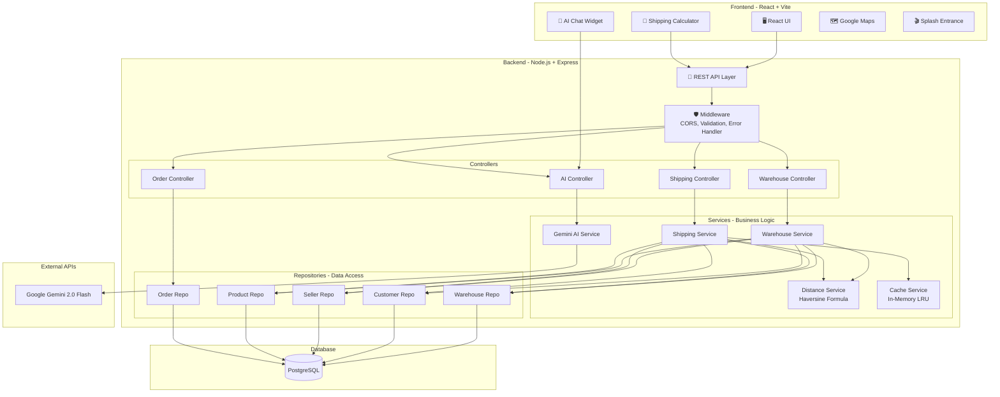

---

## 🛠 Tech Stack

| Layer | Technology | Purpose |
|:---:|:---:|:---|
| **Frontend** | React 18, Vite | Single Page Application with modern tooling |
| **Styling** | Vanilla CSS | Jumbotail brand design system |
| **Backend** | Node.js, Express | RESTful API server |
| **Backend (Familiar)** | Java, Spring Boot | Can extend with Java microservices |
| **Database** | PostgreSQL | Relational data store for all entities |
| **AI** | Google Gemini 2.0 Flash | AI-powered shipping assistant |
| **Maps** | OpenStreetMap | Location visualization |
| **Testing** | Jest | Unit tests for services |
| **Caching** | In-memory LRU | Faster shipping calculations |

---

## 📊 Entity Relationship Diagram

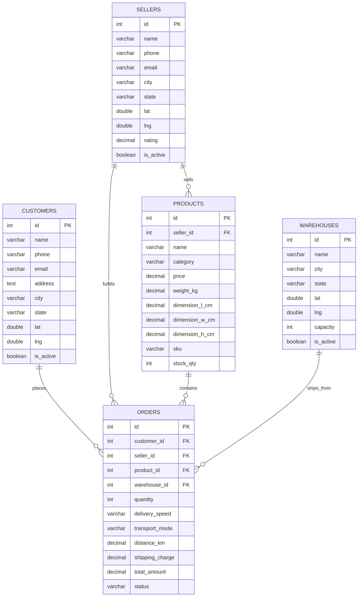

---

## 🔌 API Endpoints

### Required APIs (Assignment)

#### 1. Get Nearest Warehouse for a Seller

```http
GET /api/v1/warehouse/nearest?sellerId=1&productId=1
```

**Response:**
```json
{
  "success": true,
  "data": {
    "warehouseId": 3,
    "warehouseName": "DEL_Warehouse",
    "warehouseLocation": { "lat": 28.7041, "long": 77.1025 }
  }
}
```

#### 2. Get Shipping Charge (Warehouse → Customer)

```http
GET /api/v1/shipping-charge?warehouseId=1&customerId=1&deliverySpeed=standard
```

**Response:**
```json
{
  "success": true,
  "data": {
    "shippingCharge": 1596.03,
    "breakdown": {
      "courierCharge": 10,
      "baseShippingCharge": 1586.03,
      "expressCharge": 0,
      "distanceKm": 793.01,
      "transportMode": "Aeroplane",
      "ratePerKmPerKg": 1,
      "weightKg": 2,
      "deliverySpeed": "standard"
    }
  }
}
```

#### 3. Calculate Shipping (Seller → Customer via Nearest Warehouse)

```http
POST /api/v1/shipping-charge/calculate
Content-Type: application/json

{ "sellerId": 1, "customerId": 1, "deliverySpeed": "express" }
```

**Response:**
```json
{
  "success": true,
  "data": {
    "shippingCharge": 1597.23,
    "nearestWarehouse": {
      "warehouseId": 3,
      "warehouseLocation": { "lat": 28.7041, "long": 77.1025 }
    },
    "breakdown": { "..." }
  }
}
```

### Additional APIs

| Method | Endpoint | Description |
|:---:|:---|:---|
| `POST` | `/api/v1/ai/chat` | 🤖 Chat with Gemini AI Assistant |
| `POST` | `/api/v1/ai/analyze-shipment` | AI insights on shipping estimate |
| `GET` | `/api/v1/dashboard/stats` | Dashboard statistics |
| `GET/POST/PUT/DELETE` | `/api/v1/customers` | Customer CRUD |
| `GET/POST/PUT/DELETE` | `/api/v1/sellers` | Seller CRUD |
| `GET/POST/PUT/DELETE` | `/api/v1/products` | Product CRUD |
| `GET/POST/PUT/DELETE` | `/api/v1/warehouses` | Warehouse CRUD |
| `GET/POST/PUT/DELETE` | `/api/v1/orders` | Order CRUD |

### Error Handling

All errors return a consistent format:
```json
{
  "success": false,
  "error": { "message": "Customer with ID 999 not found", "code": 404 }
}
```

| Scenario | Status Code |
|:---|:---:|
| Missing required parameters | `400` |
| Invalid parameter format | `400` |
| Invalid delivery speed | `400` |
| Entity not found | `404` |
| No active warehouses | `404` |
| AI rate limited | `200` (graceful fallback) |
| Internal server error | `500` |

---

## 🔄 Shipping Logic Workflow

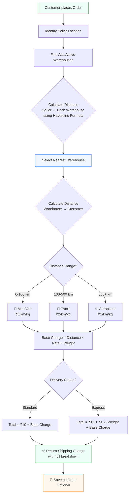

---

## 📁 Project Structure

```
jumbotail/
├── backend/
│   ├── src/
│   │   ├── controllers/          # Request handlers
│   │   │   ├── warehouseController.js
│   │   │   ├── shippingController.js
│   │   │   ├── orderController.js
│   │   │   ├── aiController.js
│   │   │   └── ...
│   │   ├── services/             # Business logic
│   │   │   ├── shippingService.js    # Core shipping calculation
│   │   │   ├── warehouseService.js   # Nearest warehouse lookup
│   │   │   ├── distanceService.js    # Haversine + transport modes
│   │   │   ├── cacheService.js       # In-memory LRU caching
│   │   │   └── geminiService.js      # Google Gemini AI
│   │   ├── repositories/         # Database queries (Data Access Layer)
│   │   │   ├── customerRepository.js
│   │   │   ├── sellerRepository.js
│   │   │   ├── productRepository.js
│   │   │   ├── warehouseRepository.js
│   │   │   └── orderRepository.js
│   │   ├── routes/               # Express route definitions
│   │   ├── middleware/           # Validation, error handling
│   │   ├── db/                   # Schema, seeds, pool config
│   │   │   ├── schema.sql
│   │   │   ├── seed.sql
│   │   │   └── pool.js
│   │   └── index.js              # Server entry point
│   ├── tests/                    # Jest unit tests
│   └── package.json
│
├── frontend/
│   ├── src/
│   │   ├── components/           # Reusable UI components
│   │   │   ├── Sidebar.jsx
│   │   │   ├── Modal.jsx
│   │   │   ├── GoogleMap.jsx
│   │   │   ├── AiChat.jsx           # 🤖 Gemini AI floating widget
│   │   │   └── SplashEntrance.jsx   # 🎬 Cinematic intro
│   │   ├── pages/                # Page-level components
│   │   │   ├── Dashboard.jsx
│   │   │   ├── Calculator.jsx       # Shipping calculator
│   │   │   ├── Products.jsx
│   │   │   ├── Customers.jsx
│   │   │   ├── Sellers.jsx
│   │   │   ├── Warehouses.jsx
│   │   │   └── Orders.jsx
│   │   ├── api.js                # Centralized HTTP client
│   │   ├── App.jsx
│   │   └── index.css             # Jumbotail design system
│   └── package.json
│
├── .gitignore
└── README.md
```

---

## ⚙️ Setup & Installation

### Prerequisites

- **Node.js** v18 or later
- **PostgreSQL** v15 or later
- **Gemini API Key** (free from [Google AI Studio](https://aistudio.google.com/apikey))

### 1. Clone the Repository

```bash
git clone https://github.com/shivakarnati2004/jumbotail-assignment.git
cd jumbotail-assignment
```

### 2. Backend Setup

```bash
cd backend
npm install
```

Create a `.env` file:
```env
DB_HOST=localhost
DB_PORT=5432
DB_USER=postgres
DB_PASSWORD=your_password
DB_NAME=jumbotail_shipping

PORT=3000
NODE_ENV=development

GEMINI_API_KEY=your_gemini_api_key
```

Initialize the database:
```bash
node src/db/init.js
```

### 3. Frontend Setup

```bash
cd frontend
npm install
```

---

## ▶️ Running the Application

### Start Backend
```bash
cd backend
node src/index.js
# 🚀 Running on http://localhost:3000
```

### Start Frontend
```bash
cd frontend
npx vite --host
# 🌐 Running on http://localhost:5173
```

---

## 🧪 Testing

```bash
cd backend
npx jest --verbose
```

### Test Coverage

| Test Suite | Tests | Status |
|:---|:---:|:---:|
| Distance Service (Haversine) | 11 | ✅ Pass |
| Shipping Charge Calculation | 11 | ✅ Pass |
| **Total** | **22** | **✅ All Pass** |

### Edge Cases Tested

- ✅ Missing query parameters → 400
- ✅ Non-existent seller/customer/warehouse → 404
- ✅ Invalid delivery speed → 400
- ✅ No active warehouses → 404
- ✅ Express pricing > Standard pricing
- ✅ Transport mode auto-detection by distance
- ✅ Haversine distance accuracy vs known distances
- ✅ Cache hit returns identical results

---

## 🎨 Design Patterns Used

| Pattern | Where Used | Purpose |
|:---|:---|:---|
| **Repository** | `repositories/` | Abstracts database queries from business logic |
| **Service Layer** | `services/` | Encapsulates business rules, decoupled from HTTP |
| **Strategy** | `distanceService.js` | Transport mode selection based on distance ranges |
| **Singleton** | `cacheService.js`, `geminiService.js` | Single instance shared across the app |
| **MVC** | Throughout | Model-View-Controller separation |
| **Middleware** | `middleware/` | Cross-cutting concerns (validation, errors, CORS) |
| **Factory** | Error handlers | Consistent error response format |

---

## 📸 Screenshots

### 🎬 Splash Entrance
> Cinematic full-screen intro with Jumbotail branding, Ken Burns parallax, and floating particles.

<p align="center">
  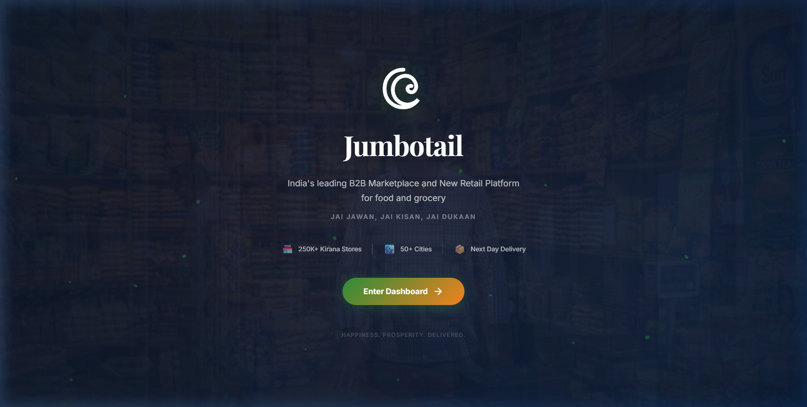
</p>

### 📊 Dashboard
> Hero banner, stat cards (Orders, Revenue, Customers, Sellers, Products, Warehouses), recent orders table.

<p align="center">
  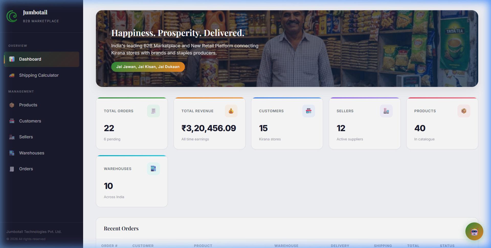
</p>

### 🚚 Shipping Calculator
> Transport mode selection cards (Auto/Mini Van/Truck/Aeroplane), route map, delivery speed, Save & Proceed to order.

<p align="center">
  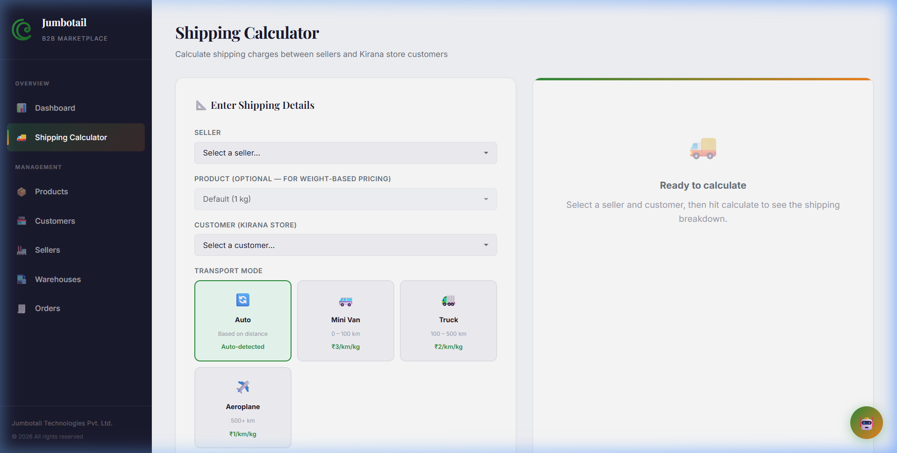
</p>

### 📦 Products Management
> Full product catalogue with categories, weight, pricing, and stock management.

<p align="center">
  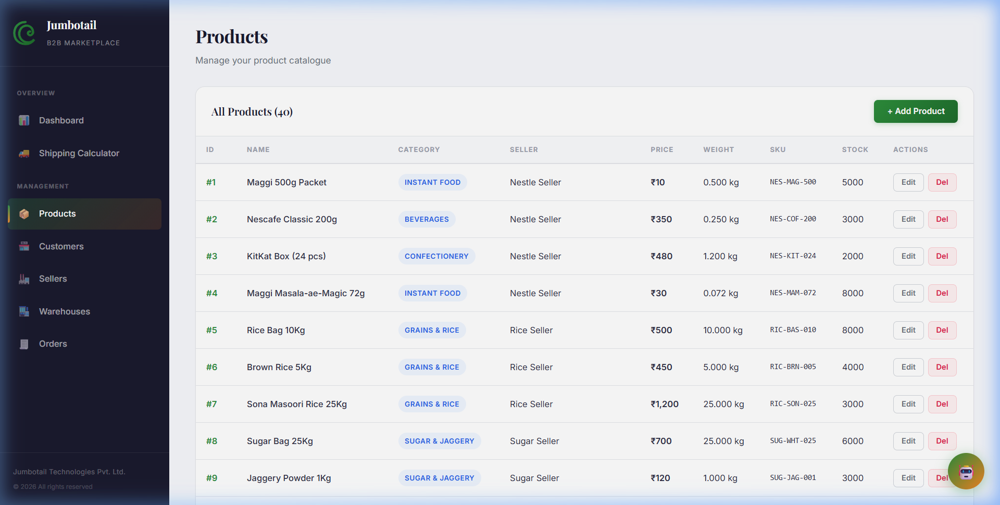
</p>

### 🏪 Customers (Kirana Stores)
> Manage Kirana store customers with location data, contact details, and order tracking.

<p align="center">
  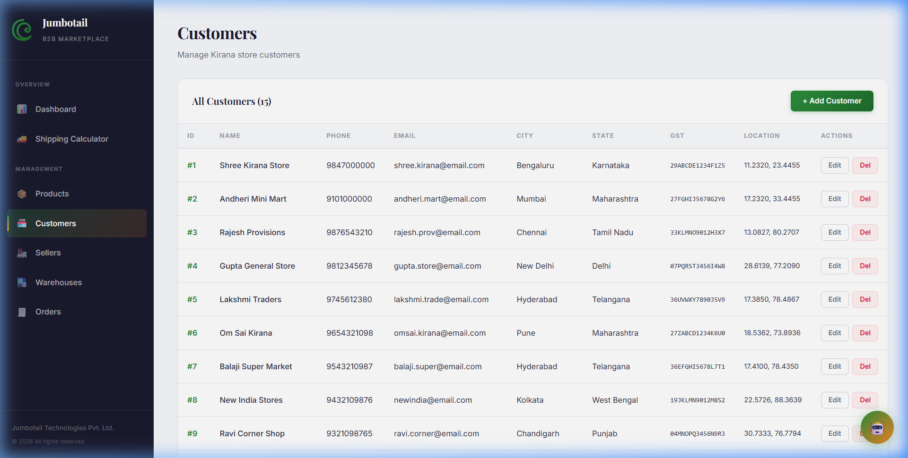
</p>

### 🧑‍💼 Sellers
> Seller management dashboard with ratings, active status, and product associations.

<p align="center">
  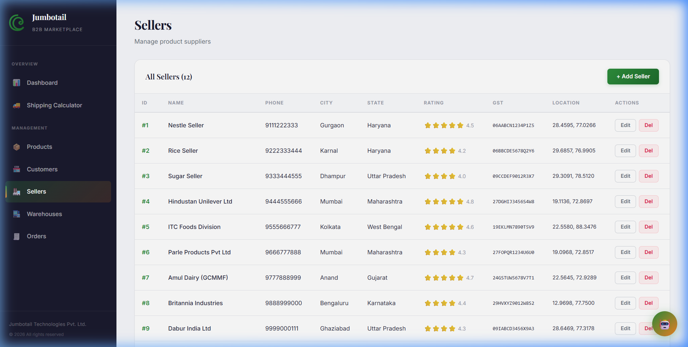
</p>

### 🏢 Warehouses with Map
> Interactive OpenStreetMap showing all 10 warehouse locations across India.

<p align="center">
  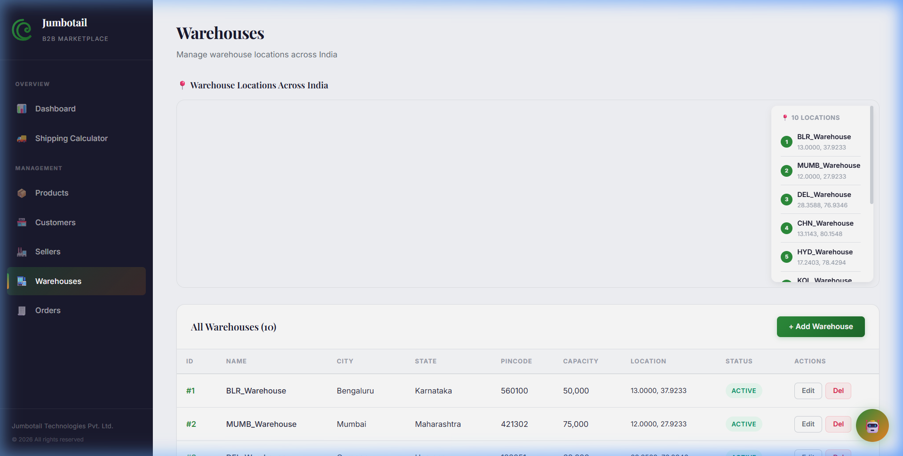
</p>

### 📋 Orders
> Order history with shipping details, delivery speed, transport mode, and cost breakdown.

<p align="center">
  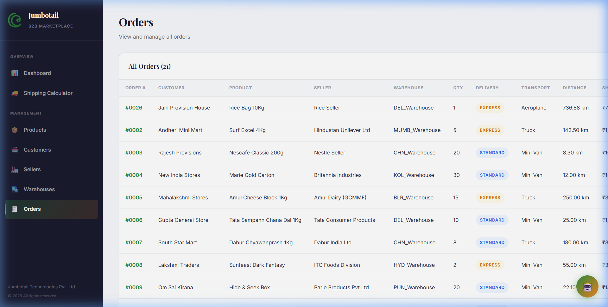
</p>

---

## 🗺️ Future Roadmap

The following features are planned for future development to evolve this into a **production-grade B2B marketplace platform**:

### 🔐 Phase 1: Authentication & Authorization
- **OTP-based phone verification** (Twilio / Firebase Auth)
- **Role-based access control (RBAC)** — Admin, Seller, Customer, Driver, Distributor
- **JWT token-based authentication** with refresh tokens
- **Session management** and secure password hashing (bcrypt)

### 👥 Phase 2: User Role System
- **Customer Portal** — Kirana store owners can browse products, place orders, track deliveries
- **Seller Dashboard** — Manage products, view orders, revenue analytics, inventory management
- **Distributor Panel** — Manage warehouses, oversee logistics, handle bulk orders
- **Driver App** — Accept deliveries, real-time location sharing, proof of delivery
- **Admin Console** — Full system management, user approvals, analytics

### 📱 Phase 3: Mobile & Real-time
- **React Native mobile app** for Kirana store owners (product browsing, ordering)
- **Driver mobile app** with GPS tracking and delivery management
- **Real-time order tracking** with WebSocket / Socket.io
- **Push notifications** for order status updates (Firebase Cloud Messaging)
- **WhatsApp Business API** integration for order confirmations

### 🚛 Phase 4: Advanced Logistics
- **Multi-stop route optimization** (Google Directions API)
- **Dynamic pricing** based on demand, fuel costs, and time of day
- **Warehouse inventory management** with stock alerts
- **Automated nearest warehouse selection** with capacity constraints
- **Return logistics** — reverse shipping for damaged/wrong products
- **Cold chain logistics** for perishable grocery items

### 💳 Phase 5: Payments & Credit
- **Razorpay/PayU integration** for online payments
- **Credit line management** for trusted Kirana stores (buy now, pay later)
- **Invoice generation** with GST compliance
- **Payment reconciliation** dashboard for sellers
- **UPI / QR code payment** at delivery

### 📊 Phase 6: Analytics & Intelligence
- **Business intelligence dashboard** with charts (D3.js / Recharts)
- **Demand forecasting** using historical order data
- **AI-powered product recommendations** for Kirana stores
- **Seller performance scoring** algorithm
- **Customer segmentation** and targeted promotions
- **Delivery time prediction** model

### 🔧 Phase 7: Infrastructure
- **Docker containerization** for easy deployment
- **CI/CD pipeline** (GitHub Actions)
- **Redis caching** instead of in-memory
- **Rate limiting** and API throttling
- **Swagger/OpenAPI documentation** auto-generation
- **Monitoring** with Grafana + Prometheus
- **Load balancing** with Nginx

---

## 🏢 Data Summary

| Entity | Count | Description |
|:---|:---:|:---|
| Customers | 15 | Kirana stores across India |
| Sellers | 12 | Product suppliers/manufacturers |
| Products | 40 | Grocery, FMCG, household items |
| Warehouses | 10 | Bengaluru, Mumbai, Delhi, Chennai, Hyderabad, Kolkata, Pune, Ahmedabad, Jaipur, Lucknow |
| Orders | 20+ | Demo + user-created orders |

---

## 📜 License

MIT License — see [LICENSE](LICENSE) for details.

---

<p align="center">
  <b>Built with ❤️ for Jumbotail</b><br/>
  <i>Happiness. Prosperity. Delivered.</i> 🛒
</p>

---

## 👋 About the Developer

Hi, I'm **Shiva Karnati**! 👨‍💻

I'm deeply passionate about building scalable, production-grade applications and I'm very enthusiastic about **internship and job opportunities**. This project showcases my ability to architect full-stack solutions with clean code, design patterns, and AI integrations.

I am genuinely excited about **Jumbotail's mission** of empowering Kirana stores across India, and I would love the opportunity to contribute more — whether it's building microservices with **Java & Spring Boot**, scaling the platform with advanced logistics, or integrating cutting-edge AI features.

**I can implement much more related to Jumbotail** — from payment gateways and real-time tracking to demand forecasting and multi-warehouse optimization. Let's build something amazing together! 🚀

📧 **Let's connect!**

<p align="center">
  <a href="https://github.com/shivakarnati2004"></a>
</p>
